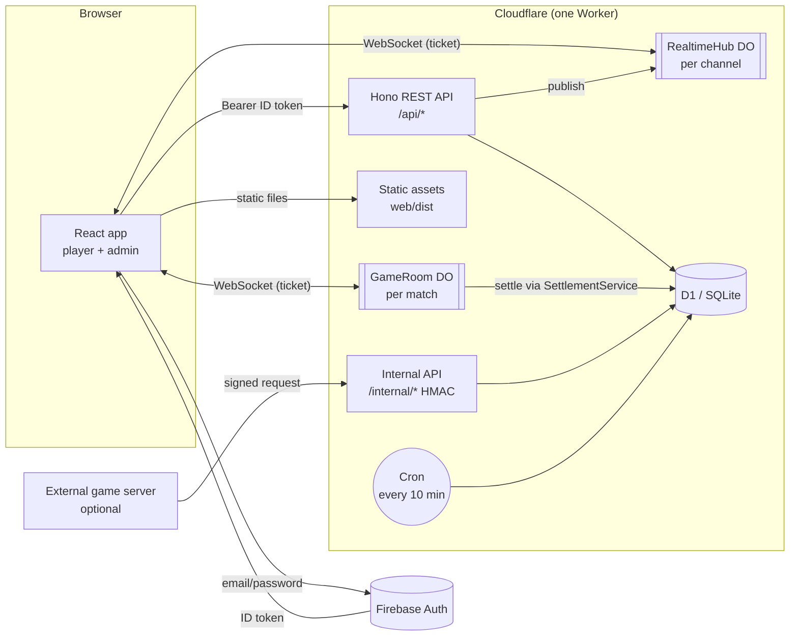
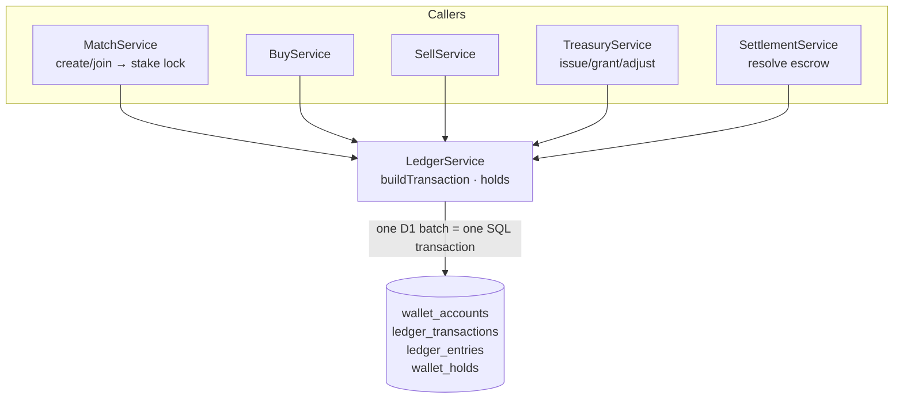
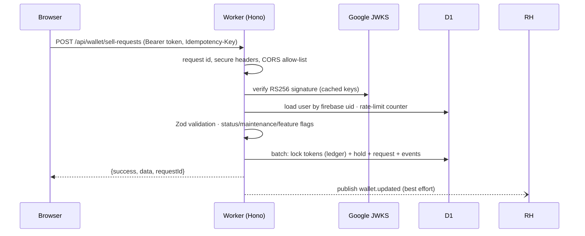

# Architecture

## Overview

* **One Worker** serves the web app (static assets), the REST API and the internal game-server API, and hosts both Durable Object classes. Same origin → simple CORS/CSRF story.
* **D1** is the single source of truth. Durable Objects hold only transient realtime state (sockets, live game state snapshots).
* **Firebase** signs users in; the Worker verifies the ID token (RS256, Google JWKS, issuer/audience/expiry) on **every** request. UIDs are never accepted from the client.

## Layers (apps/api/src)

| Layer | Folder | Responsibility |
|---|---|---|
| Routes / controllers | `routes/` | HTTP mapping, Zod validation, permission guard per route |
| Middleware | `middleware/` | authentication, user loading, RBAC, rate limiting, idempotency keys, dev-only guard |
| Services | `services/` | business rules; one service per domain |
| Repositories | `repositories/` | SQL reads and statement builders |
| Lib | `lib/` | errors, D1 batch helpers, crypto, ids, HTTP helpers |
| Durable Objects | `durable/` | RealtimeHub (fan-out), GameRoom (live match coordinator) |
| Games | `games/` | `RoomEngine` (pure, tested), module registry, reference example |

### The two authorities

* **`services/ledger.ts` — the only code that changes balances.** Every movement is a balanced ledger transaction; a source-scanning test fails if any other file writes `wallet_accounts` or `ledger_*`.
* **`services/settlement.ts` — the only code that resolves match escrow** (win, draw, void, refund, cancel). A test fails if any other file builds an escrow-resolution transaction or debits `LOCKED_GAME`.

## Atomicity and concurrency

D1 executes a `batch()` as one SQL transaction: if any statement fails, everything rolls back. Each operation is a single batch containing:

1. a **state assertion** (`INSERT INTO batch_assert … SELECT <condition>` — an INSTEAD OF trigger raises `BATCH_ASSERTION_FAILED` when false) — e.g. "this buy request is still UNDER_REVIEW";
2. the **ledger transaction** with a **UNIQUE idempotency key** (`buy:<id>:credit`, `match:<id>:resolution`, `sell:<id>:resolution`, …);
3. balance updates guarded by `CHECK (balance >= 0)` — an overdraft aborts the batch;
4. status changes, holds, events, and the **audit log row**.

Two concurrent approvals therefore cannot both succeed: the second one fails on the assertion or the unique key and the API returns `ALREADY_PROCESSED`. Tests run these races with `Promise.all`.

## Request lifecycle

## Realtime

* `POST /api/realtime/ticket {channel}` authorises a channel and returns a 60-second HMAC ticket; the browser opens `wss://…/api/realtime/connect?ticket=…`.
* Channels: `user:<id>` (notifications, wallet changes), `finance:<BUY|SELL>:<id>` (chat), `match:<id>` (lobby), `room:<matchId>` (GameRoom).
* RealtimeHub uses the **hibernation API** and auto-responds to `ping` without waking — idle sockets cost nothing on the free tier.
* Events are hints; clients re-fetch authoritative data via REST. No polling loops.

## Game rooms

See [GAME_INTEGRATION.md](GAME_INTEGRATION.md). Gameplay stays inside the `GameRoom` Durable Object (state snapshots in DO storage); only important events go to `match_events`; the validated outcome goes to the settlement service.

## Cron (every 10 minutes)

* cancel + refund rooms waiting > 30 min, READY rooms not started in 10 min;
* alert admins about matches stuck in PLAYING > 6 h (never auto-settled);
* purge old rate-limit windows and login events older than 180 days.

## Free-tier design

* Reads are indexed; lists are paginated with `LIMIT/OFFSET` and `hasMore` (no `COUNT(*)` scans per page).
* The ledger is scanned only by the on-demand integrity checker.
* Rate limiting writes one tiny row only for sensitive actions.
* No per-frame or per-move database writes; Durable Objects hibernate.
* One Worker, SQLite-backed DOs, one cron trigger — all within Workers Free limits during development/testing.
