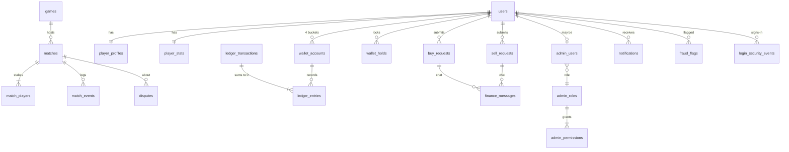

# Database (Cloudflare D1 / SQLite)

Migrations: `migrations/0001_core_schema.sql` (schema, triggers, indexes) and `migrations/0002_reference_data.sql`
(RBAC matrix, system wallets, counters, 10 game slots, default settings). Apply with `npm run db:migrate:local` / `:remote`.
Never edit an applied migration — add `0003_…sql`.

Conventions: ULID text ids · integer token **units** and **poisha** · integer epoch-ms timestamps · `created_at`/`updated_at`.



## Tables

| Table | Purpose | Key constraints |
|---|---|---|
| `counters` | last issued public numbers (player, buy, sell, match, dispute) | only incremented → numbers never reused |
| `users` | identity: firebase uid, email, status | `firebase_uid` UNIQUE; status CHECK |
| `player_profiles` | player number, username, display name, avatar | `player_number` UNIQUE ≥ 100001, immutable (trigger); `username_lower` UNIQUE; no delete |
| `player_stats` | games/wins/losses/draws/staked/won (materialised, updated in settlement batch) | leaderboard index |
| `player_notes` | append-only admin support notes | no update/delete |
| `admin_roles`, `admin_permissions`, `admin_users` | RBAC (one role per admin, can be deactivated) | |
| `wallet_accounts` | cached balance per player bucket / system wallet | `CHECK (allow_negative = 1 OR balance >= 0)`; shape immutable; no delete |
| `ledger_transactions` | one row per token operation | `idempotency_key` UNIQUE; immutable |
| `ledger_entries` | ± amount per account side, `balance_after` | immutable; amount ≠ 0 |
| `wallet_holds` | which match / sell request each locked amount belongs to | UNIQUE(reference, user); final status can't change |
| `games` | registry: 10 slots, module key, limits, flags | stake/players CHECKs |
| `matches` | room/match incl. fee snapshot, pot, result, resolution tx | status CHECK; join code unique while open |
| `match_players` | seat, stake split (bonus/available), result, payout | UNIQUE(match,user), (match,seat) |
| `match_events` | authoritative important events only | append-only |
| `buy_requests` | manual purchases incl. **rate snapshot** | `token_units = poisha × rate` CHECK; UNIQUE(user, client_key); **partial UNIQUE(method, reference) for non-rejected/cancelled** |
| `sell_requests` | redemptions incl. rate snapshot and payment proof | `bdt_poisha = units / rate` CHECK; UNIQUE outgoing payment reference |
| `finance_request_events` | status timeline | append-only |
| `finance_messages` | buy/sell chat | append-only; only `read_at` may be set once |
| `notifications` | per user, `audience` PLAYER/ADMIN | |
| `disputes` | match complaints & resolutions | one open dispute per player per match |
| `fraud_flags` | risk signals | `dedupe_key` UNIQUE |
| `audit_logs` | admin/system actions with before/after, IP, UA, request id | append-only |
| `platform_settings` | key → JSON value | |
| `login_security_events` | register/login/auth failures/admin denials | purged after 180 days |
| `rate_limit_counters` | fixed windows | purged daily |

## Indexes worth knowing

* history: `ledger_entries(user_id, created_at)`, `ledger_entries(account_id, created_at)`
* admin queues: `buy_requests(status, created_at)`, `sell_requests(status, created_at)`
* quick match: `matches(status, game_id, visibility, stake_units, created_at)`
* cron: `matches(status, updated_at)`
* audit: `audit_logs(created_at)`, `(entity_type, entity_id, created_at)`, `(action, created_at)`

## Batch assertions

```sql
CREATE VIEW batch_assert AS SELECT 1 AS ok;
CREATE TRIGGER batch_assert_insert INSTEAD OF INSERT ON batch_assert
BEGIN SELECT RAISE(ABORT, 'BATCH_ASSERTION_FAILED') WHERE NEW.ok IS NOT 1; END;
-- inside a batch:
INSERT INTO batch_assert (ok) SELECT EXISTS (SELECT 1 FROM buy_requests WHERE id = ? AND status = 'UNDER_REVIEW');
```
Verified on real local D1 (workerd) and in tests.
