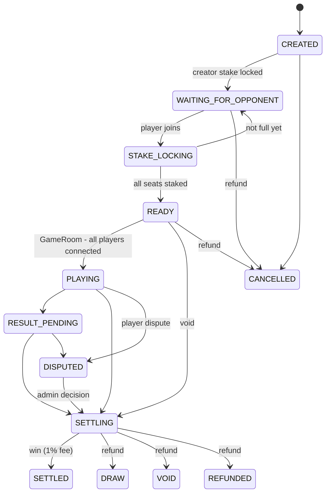

# Game integration

Games plug into the platform through two small contracts and never touch wallets:

| Side | Contract | Lives in |
|---|---|---|
| server (authoritative) | `GameModule` (`packages/shared/src/game.ts`) | one folder per game in `packages/games/src/`, registered in `server.ts` |
| browser (presentation) | `GameClient` React component | one folder per game in `apps/web/src/games/`, registered in `registry.ts` |

Installed: Ludo, Call Bridge, Twenty-Nine, Carrom, Chess (room games) and Aviator (house-banked crash game, its own `CrashGame` Durable Object). Rules: [GAMES.md](GAMES.md).

**Turn timers.** A module returns `timerAt` (absolute server ms) from any handler; the GameRoom sets a Durable Object alarm and calls `module.handleTimeout` when it fires (auto-play, pass, flag fall).

**Team wins.** `{ type: 'WIN', winnerUserId, teammateUserIds }` — the settlement service splits pot − fee equally among all winners.

## Match lifecycle

`packages/shared/src/match-state.ts` holds the transition table; the settlement service refuses any other transition. Terminal states have no exits.

## Who may do what

| Action | Allowed caller |
|---|---|
| create / join / leave room, quick match, private code | player (REST) |
| start match (READY → PLAYING) | GameRoom DO · signed internal API · dev simulator |
| settle (win/draw/void) | `SettlementService` only — invoked by GameRoom DO, signed internal API, admin dispute resolution, cron (expiry), dev simulator (non-production) |
| report winner from browser | **nobody** — no such endpoint exists |

## The GameRoom Durable Object

One instance per match (`room:<matchId>` ticket). It:

1. loads the match and the game's module by `module_key`;
2. waits until every staked player is connected → `startMatch` → marks the match PLAYING;
3. relays `{t:'move', data}` messages to `module.handleMessage`, sends each player `module.viewFor(state, player)`;
4. persists only events the module returns in `persist` (results, important moves, disconnects) to `match_events`;
5. stores an engine snapshot in DO storage after each change (survives hibernation/eviction → **match resume**);
6. on a module `outcome`, re-validates with `module.validateResult` and calls `SettlementService.settleMatch` with `source: 'GAME_SERVER'` and the module's proof.

### Disconnects, reconnects, forfeits, failures

| Hook | Behaviour |
|---|---|
| player disconnected | `module.handleDisconnect(expired:false)`; reconnect deadline = now + `disconnectPolicy.reconnectWindowMs`; DO alarm set |
| reconnect window | player reconnects before the deadline → `module.handleReconnect`, play continues |
| window expired | `disconnectPolicy.onTimeout`: `FORFEIT` → `module.handleForfeit` (opponent wins, fee) · `VOID` → refund all · `MODULE` → `handleDisconnect(expired:true)` decides |
| player forfeits | `{t:'forfeit'}` → `module.handleForfeit` |
| server failure | match PLAYING but room state lost → match **VOID**, all stakes refunded, no fee |
| match void (admin) | Admin → Match → Void & refund (via settlement service, audited) |
| stuck match | cron alerts admins after 6 h; never auto-settled |

Each module decides its own policy — nothing game-specific is hard-coded centrally.

## External game servers

If a game runs on its own server, use the signed internal API instead of the GameRoom (see [API.md](API.md#internal-game-server-api-internal-hmac)). Keep `INTERNAL_API_SECRET` only on that server.

## What is stored

| Stored in D1 | Kept only in the Durable Object |
|---|---|
| match row, players, stakes, fee snapshot, result, proof, settlement tx | per-move/per-frame state, timers, presence |
| important events (start, disconnect, forfeit, result, dispute) | animation, chat-like ephemera |

## Testing without games

* **Dev simulator** (Admin → Dev simulator, non-production): create a READY match between existing players and settle it as win / forfeit / draw / void / cancel — through the real services.
* `apps/api/src/games/reference/rock-paper-scissors.ts` is a complete reference module used by `tests/unit/room-engine.test.ts` (not registered, not one of the 10 games).
