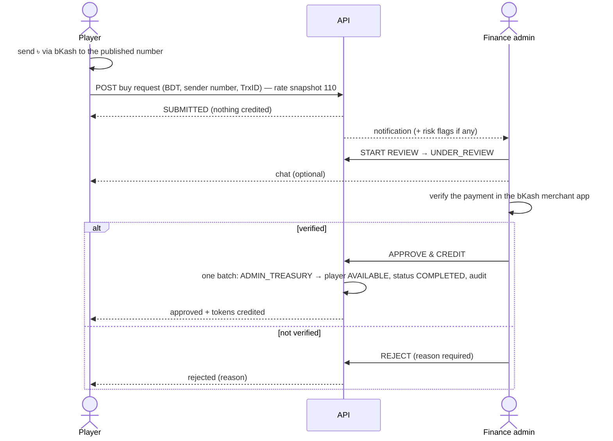
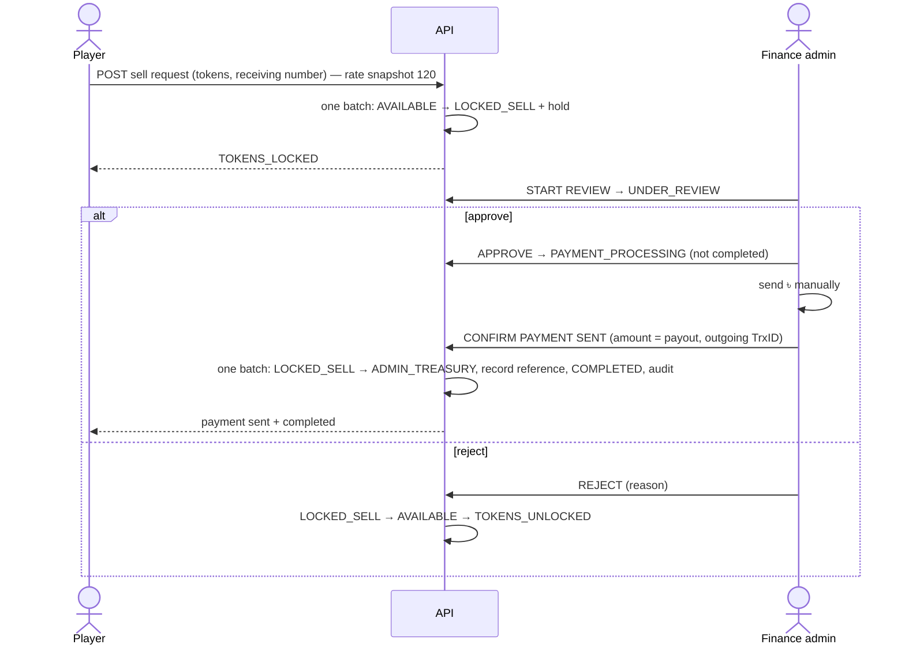

# Manual payment request flow (buy & sell)

Payments are **manual**: the platform never calls a payment API and never asks for a PIN, OTP or password.
Providers are pluggable (`packages/shared/src/payment.ts`): `BKASH_MANUAL` and `OTHER_MANUAL`, each switchable via the `enabled_payment_methods` setting; `buy_requests_enabled` / `sell_requests_enabled` turn whole flows off without affecting games.

## Buy tokens

Statuses: `SUBMITTED → UNDER_REVIEW → (APPROVED → TOKEN_CREDITED →) COMPLETED`, or `REJECTED`, or `CANCELLED` (player, only while SUBMITTED). The intermediate states are recorded in the timeline; the credit itself is a single atomic step that can happen once (`buy:<id>:credit`).

**Duplicate references.** References are normalised (trim, remove spaces, uppercase). A reference used by any SUBMITTED / UNDER_REVIEW / COMPLETED request is blocked by a partial UNIQUE index; the attempt is refused (`DUPLICATE_PAYMENT_REFERENCE`) and flagged HIGH for review. A rejected request's reference can be reused.

**Admin sees:** request number & id, player number/name, account age, BDT, tokens, rate snapshot, method, sender number (full for finance roles, masked otherwise), reference, timestamps, previous buy/sell history, current balances, risk flags (shared sender number across accounts, velocity, large amount, duplicate reference), chat, admin notes.

## Sell tokens

Example: available 20,000 → sell 12,000 → available 8,000 + locked 12,000 → payout ৳100. Locked tokens cannot be staked, sold again, transferred or spent.
Statuses: `SUBMITTED → TOKENS_LOCKED → UNDER_REVIEW → APPROVED → PAYMENT_PROCESSING → PAYMENT_SENT → COMPLETED`; or `→ REJECTED → TOKENS_UNLOCKED`; or `CANCELLED` (player, before review, tokens returned). Completion, rejection and cancellation share one idempotency key, so exactly one can happen; confirming payment twice is refused; the outgoing reference must be unique and the amount must equal the snapshotted payout.

## Chat

Every request has a private chat (player ↔ authorised finance admins), stored in `finance_messages` (no edit/delete; read receipts), pushed in realtime over the request's channel, with unread counters in lists. Players see admins as “Support team”.

## Economic safety

Buy 110 / sell 120 means buying ৳100 (11,000 TOKEN) and selling it back returns ৳91.66 — never more than paid. Production refuses any configuration where `SELL_TOKENS_PER_BDT ≤ BUY_TOKENS_PER_BDT`.

## Data minimisation

Only the sender/receiving number, reference and amounts are stored. Numbers are masked (`01******89`) for admins without finance/sensitive permissions and never appear in public profiles, rooms or leaderboards.
